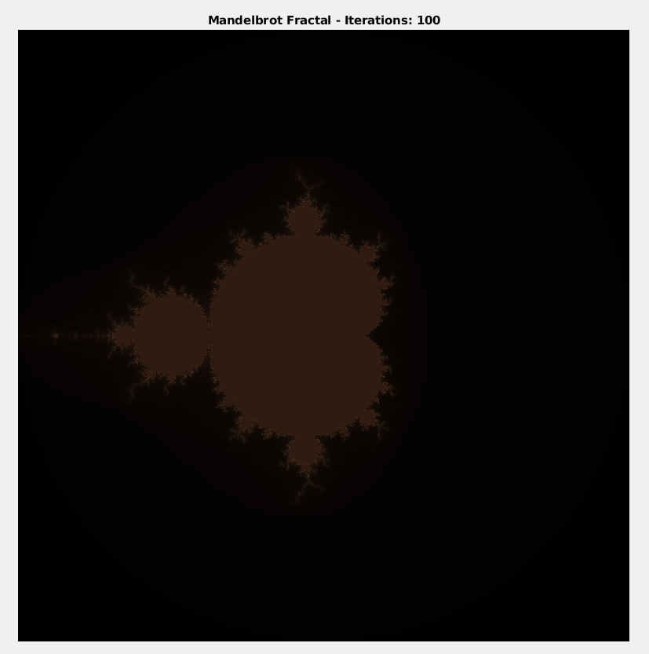
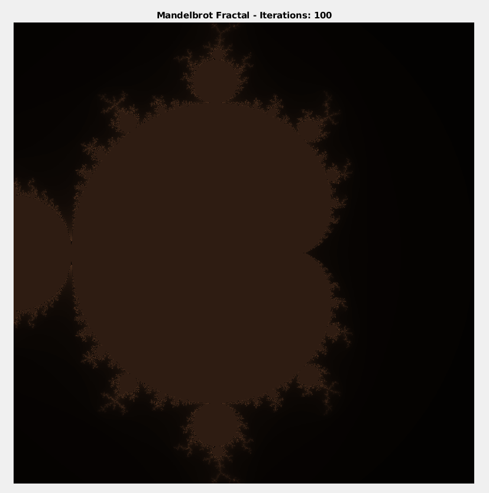
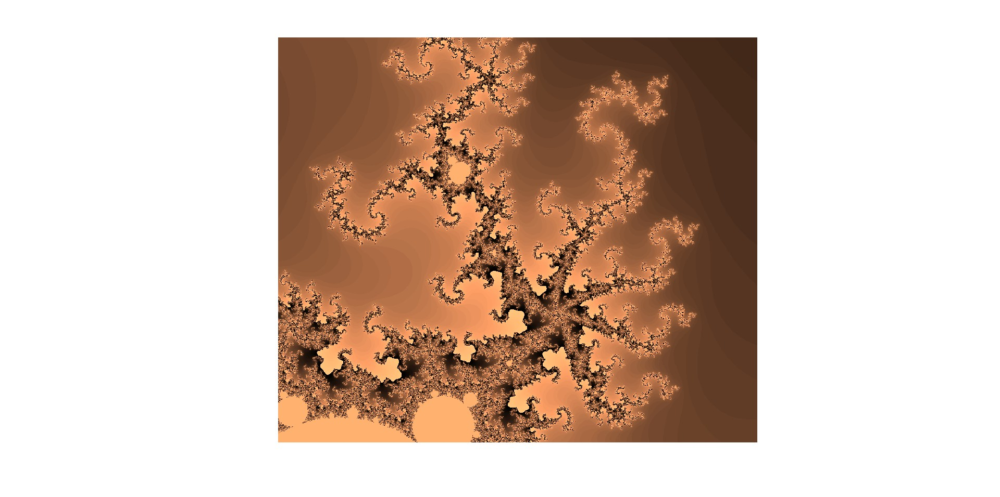
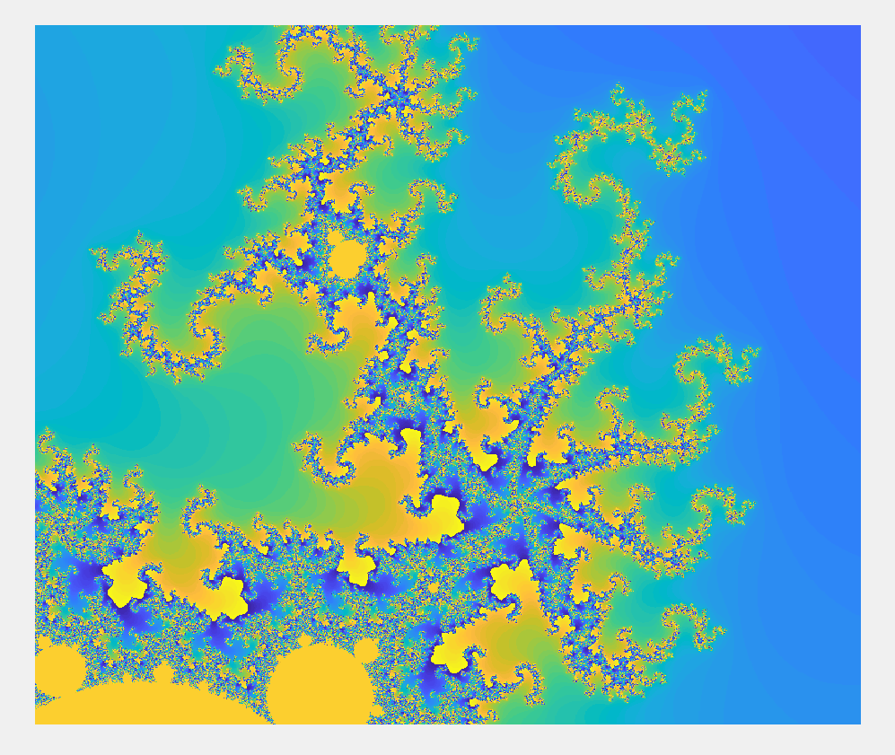
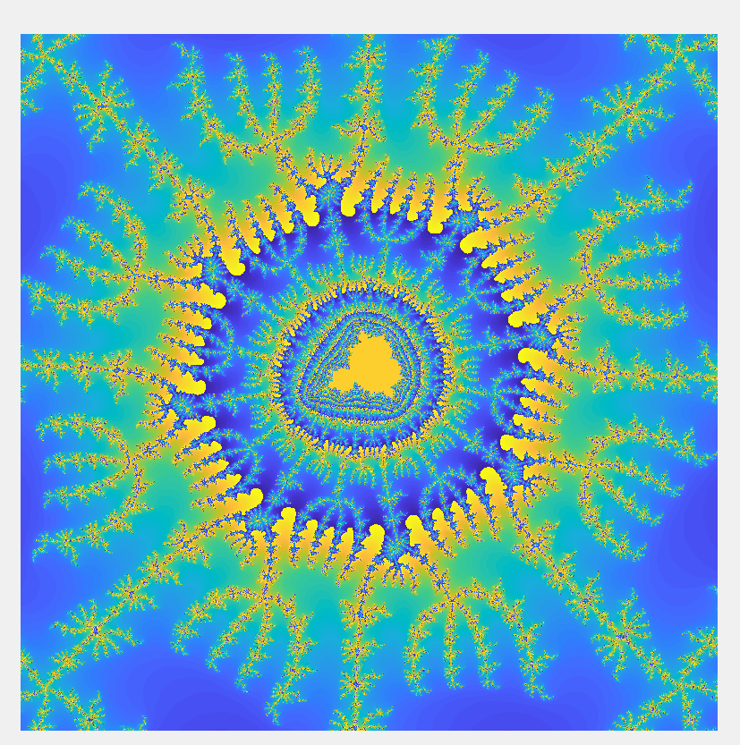

# MatrixLabo
Exploring Matlab in engineering and finance


## Mandelbrot Set
The Mandelbrot set is a region of the complex plane which is defined by 
recurrence : 
```
z(n+1) = z(n)² + c
```
where c is a complex number.
The Mandelbrot set is the set of all complex numbers c for which the sequence
does not diverge.

Property :
- if n is an integer such that |z_{n}| > 2, then the sequence diverges.

The algorithm to generate the Mandelbrot set is as follows:
1. Define a rectangle in the complex plane and divide it into a grid of points.
2. For each point c(i,j) in the grid, calculate the `k` first terms of the sequence.
3. For each point (i,j), we assign the value v(i,j), which is the first index n such that |z_(n)| > 2. If n does not exist, we assign v(i,j) = `k` + 1.
4. We then plot the matrix v(i,j) as an image.

The points in the Mandelbrot set will never outgrow the value 2,
so v(i,j) = `k` + 1 for these points.

### Exemple
c = 1 + 0.5*i, we can calculate the first terms of the sequence:
```
c = 1 + 0.5*i
Z = zeros(1,100);
for n = 1:100
    Z(n+1) = Z(n)² + c;
end
``` 

with matrice :
```
[CX,CY] = meshgrid(RangeX, RangeY);
C = CX + CY * 1i;
Z = zeros(size(C));
for n = 1:100
    Z = Z.^2 + C;
end
```

### Boolean Indexing
The boolean indexing is a technique that allows to edit only the elements of a matrix that satisfy a certain condition.
> This method optimize the time of the calculation.

```
A = [1 5 3 7 2];  
B = A > 3;        % return [0 1 0 1 0]
A(B)            % return [5 7] because A(2) and A(4) are greater than 3
A(B) = 10;  % A = [1 10 3 10 2]
```

> The naive approach I would do ...:
```
for i = 1:mx
    for j = 1:my
        Z = 0;
        C = complex_grid(i, j);
        for n = 1:100
            Z = Z^2 + C;
            if abs(Z) > 2
                V(i, j) = n;
                break;
```

But, with this method, it allow to see where are the elements of the matrice where |Z(n)| <= 2 _efficiently_.
```
Z = zeros(size(C));
V = ones(size(C));

for n = 1:100
    B = abs(Z) <= 2;
    Z(B) = Z(B).^2 + C(B);
    V(B) = V(B) + 1;
end
```

### Plotting the Mandelbrot Set
We have the  mandelbrot functions that display the image of the Mandelbrot set.




### Other views of the Mandelbrot set
Zoom 1: Center=(-0.862000000, 0.239000000), Width=0.026000000, Height=0.022000000
Zoom 2: Center=(0.435176852, 0.341773243), Width=0.000000025, Height=0.000000025




